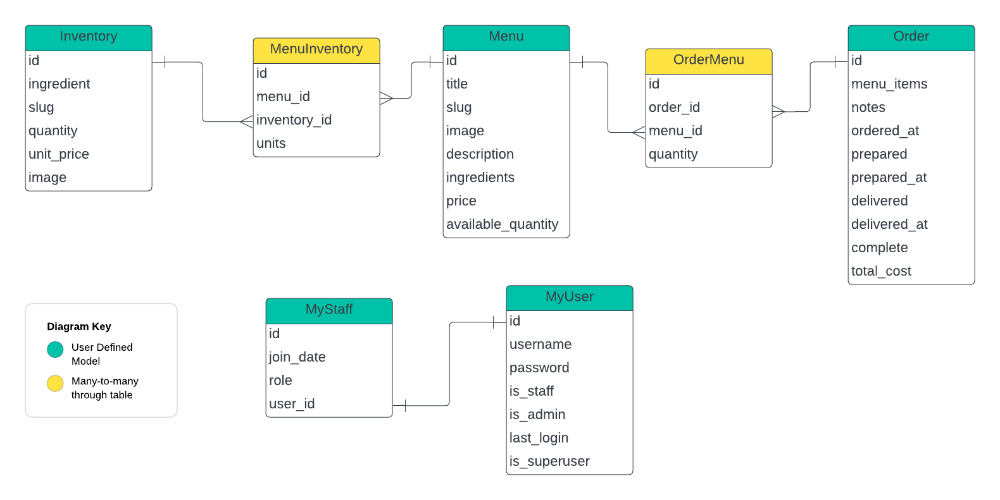

# **Moonlight Cafe**

Description: A website for small cafe owners.

The deployed version of this website can be found at [here](https://www.tea-ly.co.uk).

> **NOTE:** This repository is for the frontend only. Visit [backend](https://github.com/LyTracey/myrestaurant_backend) to view the repository for the backend of this project.

---

## **Contents**

- [Purpose](#purpose)

- [Tech Stack](#tech-stack)

    - [Backend](#backend)

    - [Frontend](#frontend)

- [Features](#features)

    - [Design](#design)

    - [Security](#security)

    - [Interactivity](#interactivity)

- [Feedback](#feedback)

---

## **Purpose**

I built this website to develop my full-stack engineering skills. I chose the perspective of managing and running a small cafe shop as a real-world scenario to develop my use cases around. Please note that this Moonlight Cafe is a fictitious cafe!

I developed this website around these main use cases:
> As a manager, I would like to have an overview of the cafe's sales, revenue, profits, and be warned of anything that's out of stock.

> As a sales staff member, I require an application I can use to record orders. I also need an overview of the cafe's sales and be warned of anything that's out of stock.

> As a chef, I need to be able to edit the menu as I curate the menu and need to be able to manage the inventory.

Please note these are made up use cases as I do not have any experience running or managing a cafe.

---

## **Tech Stack**
 
### Backend

The backed was built using Django and Django Rest Framework (DRF) connected to a MySQL database. I opted to use DRF wherever possibe as it provides many useful classes that abstracts Django for many common use cases applicable to this project.

The image below depicts the relationships between the user-defined models of the backend.



### Frontend

The frontend was built using React.js, TypeScript, React-Bootstrap, and SCSS. 

---
## **Run locally with Docker**

### Prerequisites
- .env
- python3 migrate
- docker installation
- .Dockerfiles
- docker-compose.yml

### Setting up the backend
1. Fork the backend repository using 

Here is a template of a docker-compose.yml file that can be used.

```yml
version: '1'

services:
  # Create frontend container
  frontend: # Name of our service
    image: moonlight-cafe-frontend # name of image
    build: ./frontend # path to frontend dockerfile
    ports: # Port binding to host from docker container
      - "3000:3000" # Bind port 3000 of host to 3000 of container
    container_name: frontend-docker
    restart: always # What to do if container crashes
    links:
      - backend

  # Create backend container
  backend:
    image: moonlight-cafe-backend
    # Create backend container  
    build: ./backend
    ports:
      - "8000:8000"
    container_name: backend-docker
    restart: always
    links:
      - db

  # Create database container
  db:
    image: mysql:8
    env_file:
      - .env # path to .env file providing environmental variables for this mysql database
    ports:
      - "3307:3306"
    container_name: database-docker
    restart: always
    volumes:
      - db-data:/usr/src/

volumes:
  db-data:

```

Your .env file should contain the following variables.

```.env
MYSQL_HOST=*
MYSQL_PORT=*
MYSQL_DATABASE=*
MYSQL_ROOT_PASSWORD=*
```


---

## **Features**

### Design

The design theme of this website and cafe is day and night. Select whichever them  you like best using the theme toggle in the navbar.

### Security

<ins>Authentication</ins>

For 'non-public' pages, JWT is used to authenticate users in the backend, developed using the `Simple JWT` package ([Simple JWT]: https://django-rest-framework-simplejwt.readthedocs.io/en/latest/).

For the frontend, tokens are stored as `SessionTokens` or `HTTP only` cookies.

<ins>Permissions and Customised Views</ins>

To demonstrate user permissions, 

### Interactivity

A key aspect of this project is providing an interactive platform for small cafe owners to easily retrieve summary metrics of their business.

#### Integrated Data

### Updates


### Feedback

If you experience any issues with this project, please open an issue.